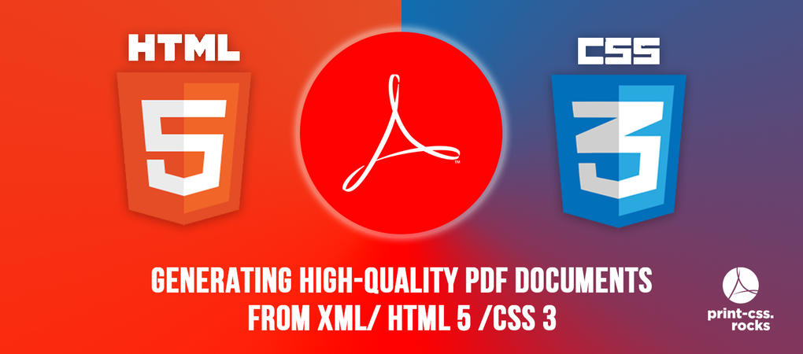

print-css.rocks - A tutorial and showcase for CSS Paged Media
=============================================================

.. toctree::
   intro.rst
   tools.rst
   lessons.rst
   compliance.rst
   supplementary.rst
   about.rst
   :maxdepth: 2

Indices and tables
==================

* :ref:`search`

Licence
=======

.. raw:: html

     print-css.rocks by <a xmlns:cc="http://creativecommons.org/ns#" href="http://www.aboutme.com/andreasjung" property="cc:attributionName" rel="cc:attributionURL">Andreas Jung</a> is licensed under a <a rel="license" href="http://creativecommons.org/licenses/by-nc-sa/4.0/">Creative Commons Attribution-NonCommercial-ShareAlike 4.0 International License</a>. Based on a work at <a xmlns:dct="http://purl.org/dc/terms/" href="https://github.com/zopyx/css-paged-media-tutorial" rel="dct:source">https://github.com/zopyx/css-paged-media-tutorial</a>.

